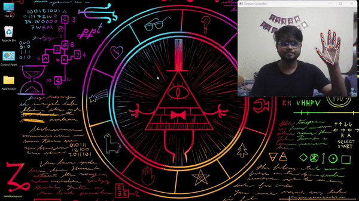
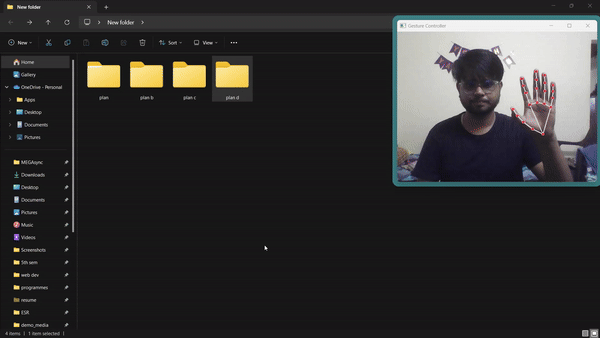
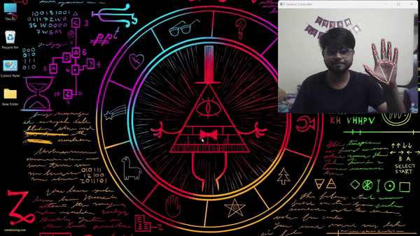
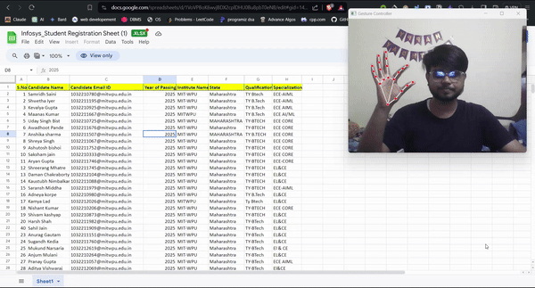
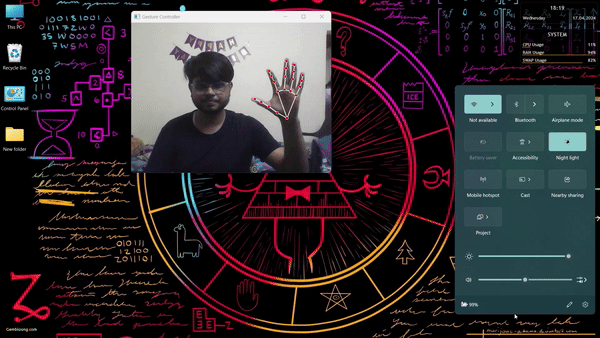

# Hand-Based Gesture Control

This project implements a hand-based gesture control system using computer vision techniques. It utilizes the MediaPipe library for hand landmark detection and tracks various hand gestures to perform actions such as mouse control, scrolling, volume adjustment, and brightness control.

## Features

## Getting Started

### Prerequisites

- Python 3.x
- OpenCV
- MediaPipe
- PyAutoGUI
- NumPy
- Google Protobuf
- PyCAW (for volume control)

### Installation

1. Clone the repository: git clone https://github.com/your-username/hand-based-gesture-control.git

2. Install the required dependencies:
pip install opencv-python mediapipe pyautogui numpy protobuf pycaw

### Usage

1. Run the `main.py` script:python main.py

2. The application will open a window displaying the camera feed.

3. Follow the on-screen instructions or gestures to control the mouse, scroll, adjust volume, and change brightness.

## Gesture Controls

- **Fist**: Click and hold (left mouse button)
- **V-Gesture**: Move the cursor
- **Index Finger**: Right-click
- **Middle Finger**: Left-click
- **Two Fingers (closed)**: Double-click
- **Pinch (major hand, horizontal)**: Adjust brightness
- **Pinch (major hand, vertical)**: Adjust volume
- **Pinch (minor hand, horizontal)**: Scroll horizontally
- **Pinch (minor hand, vertical)**: Scroll vertically

## Contributing

Contributions are welcome! If you find any issues or have suggestions for improvements, please open an issue or submit a pull request.

## License

This project is licensed under the [MIT License](LICENSE).

## Acknowledgments

- [MediaPipe](https://google.github.io/mediapipe/)
- [PyAutoGUI](https://pyautogui.readthedocs.io/en/latest/)
- [PyCAW](https://github.com/o-prime/pycaw)